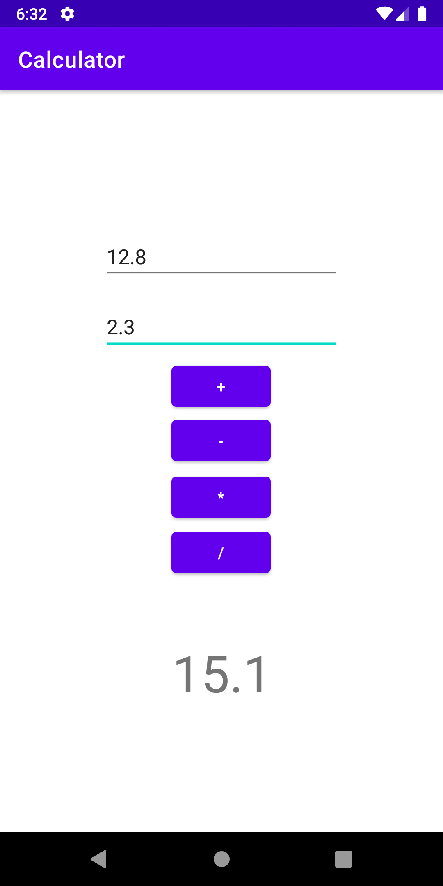

# Calculator

> Question:

> Develop an Android application using controls like Button, TextView, EditText for designing a calculator having basic functionality like Addition, Subtraction, Multiplication,and Division.

This app does only the basic calcualtions, because they had asked the same.

This took me around two hours to complete this, as I was still new to Android development. Some of the code blocks have comments explaining what they do.