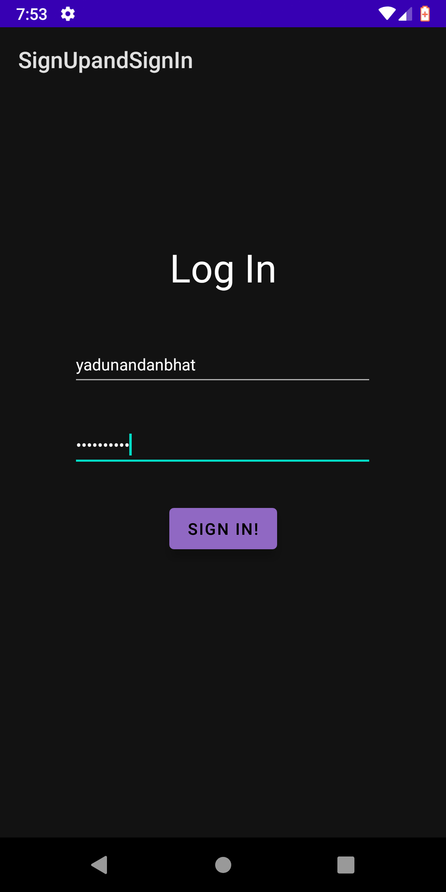

# Sign Up and Sign In

### Sign Up page


### Sign In page


> Question:

> Create a Sign Up activity with Username and Password. Validation of password should happen based on the following rules: 1. Password should contain uppercase and lowercase letters. 2. Password should contain letters and numbers. 3. Password should contain special characters. 4. Minimum length of the password (the default value is 8). On successful Sign Up, proceed to the next Login activity. Here the user should Sign In using the Username and Password created during Sign Up activity. If the Username and Password are matched then navigate to the next activity which displays a message saying “Successful Login” or else display a toast message saying “Login Failed". The user is given only two attempts and after that display a toast message saying “Failed Login Attempts” and disable the Sign In button. Use Bundle to transfer information from one activity to another.

They had asked for only two login attempts but I changed it to three. I used the following regex for password validation.

```java
^(?=.*[A-Z])(?=.*[a-z])(?=.*\\d)(?=.*[@$!])[A-Za-z\\d@$!]{8,}$"
```

After three failed atempts it shows "Tries exceeded more than 3. Sign in disabled!".

Some of the code blocks have comments explaining what they do.